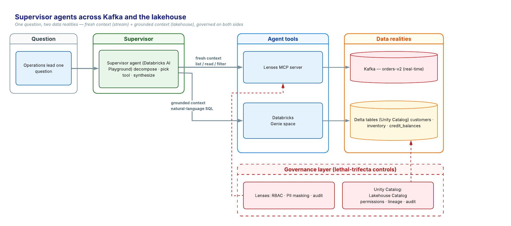

# Supervisor agent across Kafka and the lakehouse — demo kit

A single **supervisor agent** in Databricks AI Playground answers questions that span **two data realities**:

- **fresh context** — live order events in **Kafka**, exposed via a **Lenses MCP server**
- **grounded context** — customer credit / inventory / history in **Delta** tables, exposed via a **Databricks Genie space**

The payoff is a multi-hop question that needs both at once — e.g. *"of the orders in the last hour, which are from customers within 10% of their credit limit?"* — answered by one agent, no copy-paste between tools.



> **Scope:** this kit assumes you **already have Lenses** running with its MCP server and a registered environment, reachable by Databricks. Standing up Lenses itself is **out of scope**. Everything else — datasets, Genie config, the agent prompt, and the demo script — is here.

---

## Repo contents

| File | What it is |
|------|------------|
| [`data/delta_tables.sql`](data/delta_tables.sql) | The three Delta tables (`customers`, `inventory`, `credit_balances`), internally consistent |
| [`data/gen_orders.py`](data/gen_orders.py) | Generates the Kafka order events (timestamps relative to *now*) |
| [`data/load_kafka.sh`](data/load_kafka.sh) | Example: create the topic + produce the events |
| [`genie/genie_space_config.md`](genie/genie_space_config.md) | Genie space: tables, sample questions, instructions, expected answers |
| [`agent/system_prompt.md`](agent/system_prompt.md) | Supervisor system prompt — routing rules for both tools |
| [`demo/demo_script.md`](demo/demo_script.md) | The 4-round demo + talk track + the live "wow" order |
| [`diagrams/supervisor_architecture.png`](diagrams/supervisor_architecture.png) | The architecture diagram above |

---

## Prerequisites

- A **Lenses** instance (6.2+) with the **MCP server** enabled and a registered **environment** (note its name — e.g. `demo`).
- A **Databricks** workspace with **Unity Catalog**, **Genie**, and **AI Playground**, using a tool-calling model (e.g. `claude-sonnet-4-6`).
- The Lenses MCP server **registered as a Unity Catalog HTTP connection** (Is MCP connection, **OAuth** auth — MCP is OAuth/DCR-only; static bearer tokens are rejected).
- Access to your Lenses environment's Kafka to create a topic and produce messages.

Set these placeholders to your values throughout:

| Placeholder | Meaning | Example |
|---|---|---|
| `<CATALOG>.<SCHEMA>` | Where the Delta tables live | `lenses_demo.silver` |
| `<LENSES_ENVIRONMENT>` | Your Lenses environment name | `demo` |
| `orders-v2` | Kafka topic for orders | `orders-v2` |

---

## The flow (end to end)

```
1. Delta tables ─┐
2. Kafka events ─┴─► 3. Genie space ─┐
                                      ├─► 4. Attach both tools ─► 5. System prompt ─► 6. Run the demo
            Lenses MCP ───────────────┘
```

### 1. Load the Delta tables → [`data/delta_tables.sql`](data/delta_tables.sql)
Adjust the catalog/schema at the top, run it in a SQL editor or notebook. Verify: 10 customers, 12 inventory rows, 10 credit_balances; **3 products below reorder threshold**; **2 customers within 10% of their credit limit**.

### 2. Load the Kafka demo data → [`data/gen_orders.py`](data/gen_orders.py) + [`data/load_kafka.sh`](data/load_kafka.sh)
Generate ~30 order events (6 within the last hour) and produce them to your topic:
```bash
python3 data/gen_orders.py | kafka-console-producer --bootstrap-server <BOOTSTRAP> --topic orders-v2
```
See [`load_kafka.sh`](data/load_kafka.sh) for a ready-made script (PATH and docker variants + the live "wow" order). **Re-run before any live demo** so the "last hour" window is fresh.

### 3. Build the Genie space → [`genie/genie_space_config.md`](genie/genie_space_config.md)
Add the three tables, the sample questions, and the instructions. Test the sample questions until Genie answers them correctly. *(Curation matters — without the instructions, Genie won't map "YTD orders" to `ytd_orders_eur`.)*

### 4. Attach both tools in AI Playground
In **one** session, attach the **Genie space** *and* the **Lenses MCP** connection. Authorize the Lenses MCP (OAuth consent) on first use. **Remove the Python/code-exec tool** (`system.ai.python_exec`) if the workspace auto-adds it.

### 5. Set the supervisor system prompt → [`agent/system_prompt.md`](agent/system_prompt.md)
Paste it into the Playground system-prompt field and **set your `<LENSES_ENVIRONMENT>` name** — Lenses MCP tools require an `environment` parameter; the wrong value returns `404 Environment not found`.

### 6. Run the demo → [`demo/demo_script.md`](demo/demo_script.md)
Four rounds: grounded → fresh → multi-hop → action, with the live "wow" order and talk track.

---

## Gotchas worth knowing (learned the hard way)

- **MCP is OAuth/DCR-only** — don't use static bearer tokens on the UC connection.
- **Lenses MCP tools need the `environment` name** — set it in the [system prompt](agent/system_prompt.md).
- **Genie needs curation** — add the [column instructions](genie/genie_space_config.md) or it won't find the right fields.
- **Drop `system.ai.python_exec`** from the Playground tools if it auto-attaches.
- **Default Storage** can block `CREATE CATALOG` — use an existing managed catalog and adjust the names in [`delta_tables.sql`](data/delta_tables.sql).
